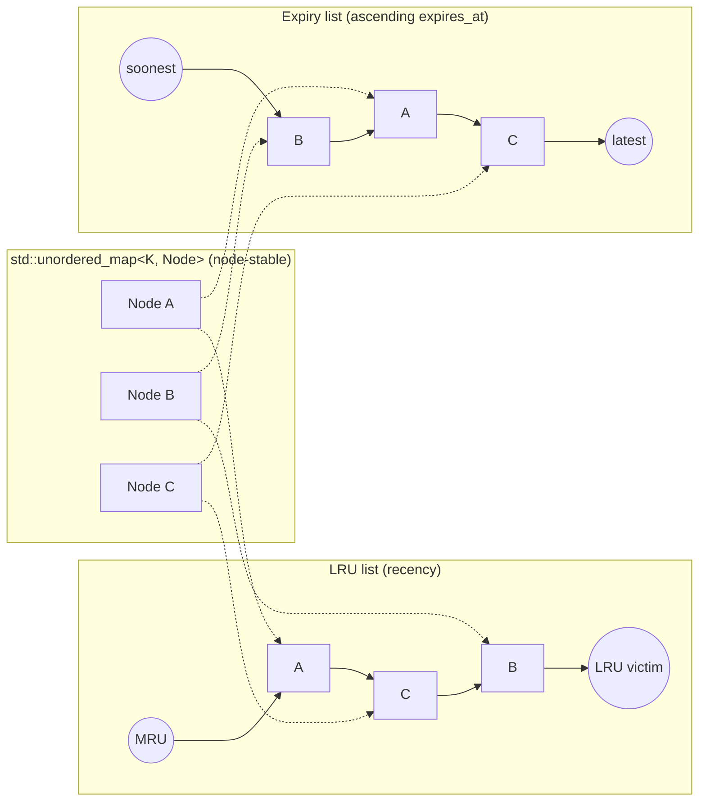
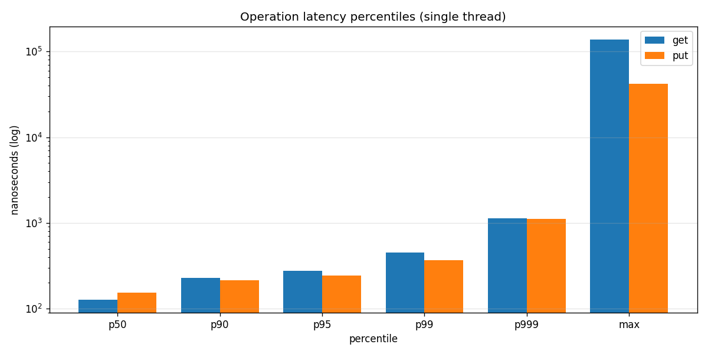
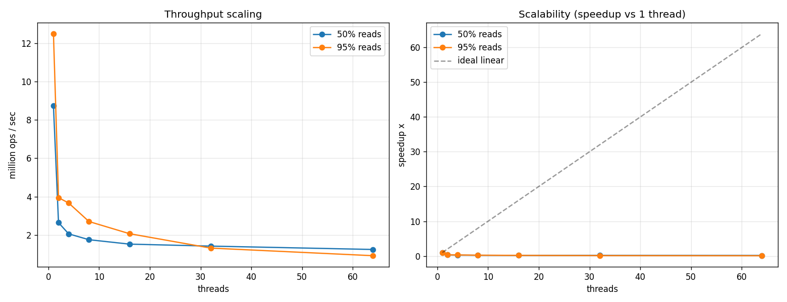
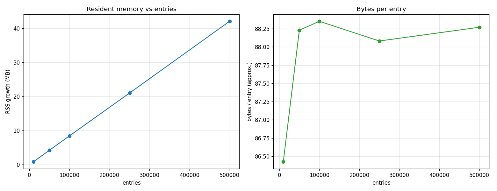
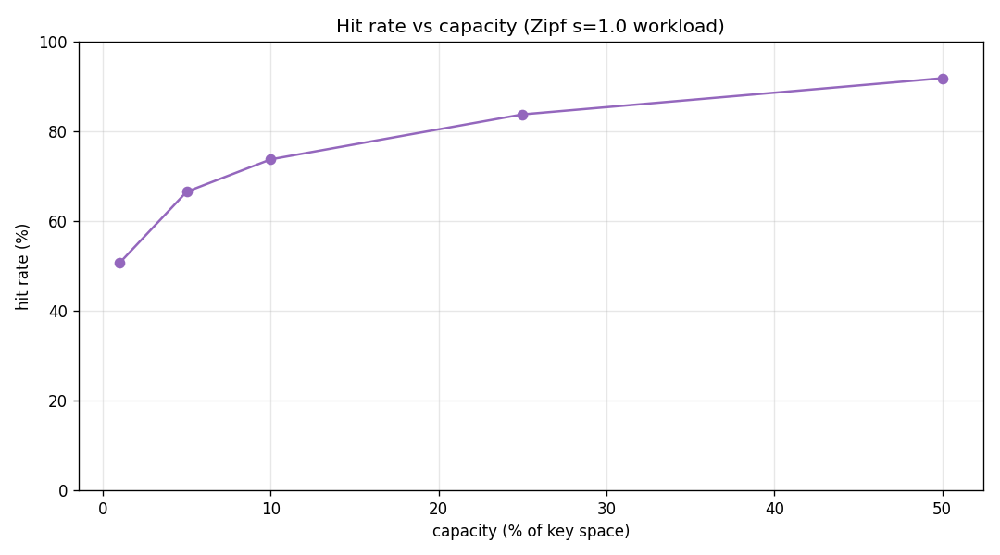

# Concurrent Cache

> A header-only, high-performance **C++17 thread-safe LRU cache** with **TTL expiration**, a background sweeper, and built-in observability.


The hot path (`get` / `put` / `erase`) is **O(1)** with no per-call allocations, and
TTL reclamation is **O(k)** in the number of *expired* entries — never O(n) over the
whole cache. On `<int64_t, int64_t>` it sustains **~9–12M ops/sec single-threaded**
with **~127 ns p50 / 452 ns p99** lookups (see [Benchmarks](#benchmarks)).

> **Demo:** *drop an animated terminal capture here* (e.g. recorded with [`vhs`](https://github.com/charmbracelet/vhs) or `asciinema` → `agg`):
> ``

## Highlights

| | |
| --- | --- |
| **O(1) hot path** | `get` / `put` / `erase` touch a handful of pointers; no allocation beyond one map node |
| **O(k) expiry** | Constant TTL keeps the expiry list sorted, so purging walks only the expired prefix |
| **Thread-safe** | Every operation serialized by one mutex; the background sweeper shares the same lock |
| **TTL + LRU** | Entries leave on TTL elapse *or* LRU eviction at capacity — whichever comes first |
| **Background cleanup** | Optional worker reclaims memory without user traffic; disable for purely lazy reclaim |
| **Generic** | Templated on `<K, V, Hash, KeyEqual>` — any hashable key, any copyable/movable value |
| **Observable** | Live hit / miss / eviction / expiration counters via `stats()` |
| **Header-only** | One `#include`, no link step |

## Architecture

Each entry lives **once** in a node-based `std::unordered_map` (addresses stay stable
across rehashes) and is threaded through **two intrusive doubly-linked lists** that share
those nodes — one ordering by recency, one by expiry time.



- **`get` hit** → move node to LRU front. **`put`** → append to expiry tail (largest `expires_at`), move to LRU front.
- **Eviction** → drop the LRU list tail. **Expiry purge** → pop the expiry list head until the first live entry.

### Complexity

| Operation | Time | Allocations |
| --- | --- | --- |
| `get` / `peek` / `contains` | O(1) amortized | 0 |
| `put` (insert or update) | O(1) amortized | ≤ 1 map node |
| `erase` | O(1) amortized | 0 |
| TTL purge (lazy or background) | O(k), k = expired entries | 0 |

## Features

- **Thread-Safe**: All operations are serialized by a single mutex, safe for concurrent access
- **O(1) Hot Path**: `put`, `get`, and `erase` are O(1) amortized with no per-call allocations
- **Efficient Expiry**: Expired entries are purged in O(k) (number of expired items), not O(n) over the whole cache
- **TTL Expiration**: Automatic expiration of entries based on time-to-live
- **LRU Eviction**: Evicts least recently used entries when capacity is reached
- **Background Cleanup**: Optional worker thread periodically sweeps expired entries
- **Any Key/Value Type**: Templated on `<K, V, Hash, KeyEqual>` — use any hashable key, any value
- **Observability**: Built-in hit/miss/eviction/expiration counters via `stats()`
- **Header-Only**: Easy to integrate, just include the header file
- **Modern C++**: Uses C++17 features (std::optional, std::chrono, etc.)

## Requirements

- C++17 or later
- CMake 3.14 or later (for building tests)
- Google Test (automatically downloaded via CMake FetchContent)

## Quick Start

### Basic Usage

```cpp
#include <lru_ttl_cache_thread_safe.hpp>
#include <chrono>

using namespace std::chrono_literals;

// Create a cache with capacity 100, TTL of 5 seconds
LruTtlCacheThreadSafe<int, std::string> cache(100, 5s);

// Insert values
cache.put(1, "value1");
cache.put(2, "value2");

// Retrieve values
auto value = cache.get(1);
if (value.has_value()) {
    std::cout << *value << std::endl;  // Prints "value1"
}

// Check if expired
std::this_thread::sleep_for(6s);
auto expired = cache.get(1);
if (!expired.has_value()) {
    std::cout << "Entry expired!" << std::endl;
}
```

### API Reference

#### Template Parameters

```cpp
template <typename K,
          typename V,
          typename Hash     = std::hash<K>,
          typename KeyEqual = std::equal_to<K>>
class LruTtlCacheThreadSafe;
```

- `K`: Key type (any type hashable by `Hash` and comparable by `KeyEqual`)
- `V`: Value type (copyable or movable; does not need to be default-constructible)
- `Hash` / `KeyEqual`: Provide custom functors to support user-defined key types

#### Constructor

```cpp
LruTtlCacheThreadSafe(std::size_t capacity,
                      Duration ttl,
                      Duration sweep_interval = std::chrono::seconds(1))
```

- `capacity`: Maximum number of entries in the cache (must be > 0)
- `ttl`: Time-to-live duration for entries (must be > 0)
- `sweep_interval`: Interval between background cleanup sweeps (default: 1 second). Pass `Duration::zero()` to disable the background worker and reclaim expired entries lazily on access.

#### Methods

- `void put(K const& key, V const& value)`: Insert or update a key-value pair
- `void put(K const& key, V&& value)`: Insert or update using move semantics
- `std::optional<V> get(K const& key)`: Retrieve a value, refreshing its LRU position (returns `std::nullopt` if not found or expired)
- `std::optional<V> peek(K const& key)`: Retrieve a value *without* updating its LRU position
- `bool contains(K const& key)`: Check for a live entry without promoting it
- `bool erase(K const& key)`: Remove a key-value pair (returns `true` if found and removed)
- `void clear()`: Clear all entries from the cache
- `std::size_t size() const`: Get the current number of entries
- `bool empty() const`: Check if the cache is empty
- `std::size_t capacity() const`: Get the maximum capacity
- `Duration ttl() const`: Get the TTL duration
- `Stats stats() const`: Snapshot of hit/miss/eviction/expiration counters
- `void resetStats()`: Reset all counters to zero

## Building and Testing

### Build the Project

```bash
mkdir build
cd build
cmake ..
cmake --build .
```

### Run Tests

```bash
cd build
ctest
# or run directly
./test_lru_ttl_cache
```

### Build Without Tests

```bash
cmake -DBUILD_TESTS=OFF ..
cmake --build .
```

## Benchmarks

The project ships a self-contained benchmark that measures **throughput scaling,
latency percentiles, memory footprint, and hit rate**, plus a Python script that
renders the charts below.

```bash
cmake -S . -B build && cmake --build build -j
./build/cache_benchmark                       # writes ./bench_results/*.csv
pip install matplotlib
python3 scripts/visualize.py bench_results    # writes ./bench_results/*.png
```

> Numbers below were measured with `<int64_t, int64_t>` on a multi-core Linux
> machine. **Your figures will vary** — re-run the harness to reproduce them locally.

### Latency (single thread)

`get` and `put` on a warm 100k-entry cache, 500k sampled operations each.



| Operation | p50 | p90 | p95 | p99 | p99.9 |
| --------- | ---: | ---: | ---: | ---: | -----: |
| `get` | 127 ns | 227 ns | 277 ns | 452 ns | 1.14 µs |
| `put` | 153 ns | 216 ns | 243 ns | 366 ns | 1.12 µs |

### Throughput & scalability

Mixed `get`/`put` workload over a 100k-entry cache, at 50% and 95% read mixes.



| Threads | 50% reads | 95% reads |
| ------- | ---------: | ---------: |
| 1 | 8.7M ops/s | 12.5M ops/s |
| 2 | 2.6M ops/s | 3.9M ops/s |
| 8 | 1.8M ops/s | 2.7M ops/s |
| 64 | 1.2M ops/s | 0.9M ops/s |

Throughput **peaks single-threaded**: the single global mutex means additional
threads contend on one lock rather than scale. This is a deliberate
simplicity/correctness trade-off — see [Concurrency & limitations](#concurrency--limitations)
for the sharding mitigation.

### Memory

Resident-set growth vs. entry count; the intrusive-list design keeps overhead flat.



| Entries | RSS growth | Bytes/entry |
| ------- | ----------: | -----------: |
| 10k | 0.86 MB | 86.4 |
| 100k | 8.84 MB | 88.4 |
| 500k | 44.1 MB | 88.3 |

**≈ 88 bytes/entry**, stable as the cache grows (node + map bucket overhead).

### Hit rate

Hit ratio vs. capacity under a Zipf-skewed (s = 1.0) key distribution.



| Capacity (% of key space) | Hit rate |
| ------------------------- | --------: |
| 1% | 50.7% |
| 10% | 73.7% |
| 25% | 83.7% |
| 50% | 91.8% |

### Memory & data-race analysis (sanitizers)

```bash
# ThreadSanitizer — detect data races in concurrent tests
cmake -S . -B build-tsan -DENABLE_TSAN=ON && cmake --build build-tsan -j
./build-tsan/test_lru_ttl_cache

# Address/UB Sanitizer — detect memory errors and leaks
cmake -S . -B build-asan -DENABLE_ASAN=ON && cmake --build build-asan -j
./build-asan/test_lru_ttl_cache
```

For a heap-usage-over-time profile, run the benchmark under Valgrind Massif:

```bash
valgrind --tool=massif ./build/cache_benchmark && ms_print massif.out.*
```

The benchmark is built by default; toggle it with `-DBUILD_BENCHMARKS=ON/OFF`.

## Design Details

### Thread Safety

All public methods are protected by a mutex, ensuring thread-safe access. The cache can be safely used from multiple threads concurrently.

### Expiration Strategy

1. **On Access**: When `get()` is called, the entry is checked for expiration and removed if expired
2. **On Insert**: When `put()` is called, expired entries are evicted before inserting new ones
3. **Background Worker**: A dedicated thread periodically sweeps expired entries based on `sweep_interval`

### Eviction Policy

When the cache reaches capacity:

1. Expired entries are removed first (from oldest to newest)
2. If still at capacity, the least recently used (LRU) entry is evicted

### Performance Considerations

- **O(1) Operations**: Each entry is stored once in a node-based `std::unordered_map` and threaded through two intrusive doubly-linked lists (one for LRU order, one for expiry order). `put`/`get`/`erase` touch only a handful of pointers — O(1) amortized.
- **O(k) Purge**: Because the TTL is constant and `get()` does not refresh it, the expiry list stays sorted; purging only walks the soonest-to-expire end and stops at the first live entry.
- **Lock Granularity**: A single mutex protects all operations, which ensures correctness but may limit throughput under high contention
- **Background Sweep**: The optional background worker keeps the cache clean; disable it with `sweep_interval = Duration::zero()` if you prefer purely lazy reclamation
- **Move Semantics**: Use `put(key, std::move(value))` for better performance with large objects

## Example Use Cases

- **Session Management**: Store user sessions with automatic expiration
- **API Response Caching**: Cache API responses with TTL
- **Rate Limiting**: Track request counts with automatic cleanup
- **Configuration Caching**: Cache configuration values that need periodic refresh

## Thread Safety Guarantees

- Multiple threads can call `put()`, `get()`, `erase()`, `clear()`, `size()`, and `empty()` concurrently
- All operations are atomic with respect to each other
- The background worker thread safely cleans up expired entries

## Concurrency & limitations

A single mutex guards the map and both intrusive lists, which makes correctness easy
to reason about — the background sweeper simply takes the same lock. The trade-off is
scalability:

- **Single mutex**: All operations share one lock, so throughput does not scale with
  threads under contention. For high concurrency, **shard N independent caches by
  `hash(key) % N`**; each shard keeps the O(1)/O(k) guarantees while spreading lock
  traffic. A relaxed/approximate LRU (CLOCK, sampled eviction) is the other common path.
- **No TTL refresh on read**: `get()` does not extend an entry's TTL. This is
  intentional — a constant TTL keeps the expiry list sorted, which is what makes
  purging O(k) instead of O(n).
- **Non-copyable / non-movable**: The cache owns a background thread, so it is neither
  copyable nor movable. Wrap it in `std::unique_ptr` / `std::shared_ptr` to relocate ownership.

## Roadmap

- [ ] Sharded wrapper (`ShardedLruTtlCache<N>`) for lock-striped concurrency
- [ ] Optional per-entry TTL override on `put`
- [ ] `get_or_compute` (single-flight) to collapse duplicate misses
- [ ] Pluggable clock for deterministic testing of expiry
- [ ] CI matrix (GCC/Clang/MSVC) with TSan/ASan gates

## License

Provided as-is for educational and practical use. Add a `LICENSE` file (MIT is a
common choice for header-only libraries) to set explicit terms before distribution.

## Contributing

Contributions are welcome — please open an issue or pull request. New behavior should
ship with a Google Test case and stay clean under ThreadSanitizer and AddressSanitizer.
